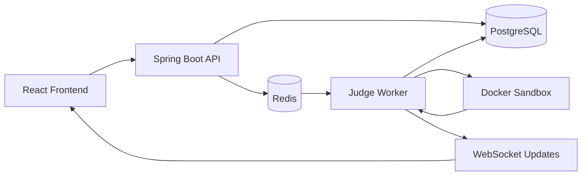

# Online Coding Judge

A production-oriented, full-stack **Online Coding Judge** for solving programming problems, running code against test cases, submitting solutions, participating in contests, and tracking coding progress.

The platform is designed around an asynchronous judging architecture where submitted code is executed inside isolated Docker containers rather than directly on the backend server.

> **Important:** This project treats user-submitted code as potentially malicious. Code execution is isolated from the Spring Boot API using a dedicated Judge Worker and Docker-based sandboxing.

---

## 🚀 Features

### 👤 Authentication & Authorization

* User registration and login
* JWT access and refresh tokens
* BCrypt password hashing
* Logout
* Role-based authorization
* `USER` and `ADMIN` roles
* Protected API endpoints
* Secure error handling

### 🧩 Problems

* Browse programming problems
* Search problems
* Filter by difficulty
* Filter by tags
* Solved/unsolved filtering
* Pagination and sorting
* Problem descriptions
* Constraints
* Input/output formats
* Examples
* Starter code
* Supported languages
* Time and memory limits
* Public and hidden test cases

### 💻 Supported Languages

The initial implementation supports:

* Java
* Python
* C++
* JavaScript

Language-specific configuration is centralized so that Docker images, source filenames, compilation commands, execution commands, and resource limits are not scattered throughout the application.

### ⚡ Code Execution & Judging

Submissions are processed asynchronously:

```text
User
 │
 ▼
React Frontend
 │
 ▼
Spring Boot API
 │
 ▼
PostgreSQL
 │
 ▼
Redis Submission Queue
 │
 ▼
Judge Worker
 │
 ▼
Docker Sandbox
 │
 ├── Compile
 │
 ├── Execute
 │
 ├── Run Tests
 │
 └── Measure Resources
 │
 ▼
Verdict
 │
 ├── ACCEPTED
 ├── WRONG_ANSWER
 ├── TIME_LIMIT_EXCEEDED
 ├── MEMORY_LIMIT_EXCEEDED
 ├── COMPILATION_ERROR
 ├── RUNTIME_ERROR
 └── INTERNAL_ERROR
 │
 ▼
PostgreSQL
 │
 ▼
WebSocket
 │
 ▼
React Frontend
```

The Spring Boot server **never executes user code directly**.

### 🧪 Run vs Submit

#### Run

Runs submitted code against **public test cases only**.

The user can see:

* Program output
* Expected output
* Pass/fail status
* Runtime
* Errors

#### Submit

Runs the solution against:

* Public test cases
* Hidden test cases

The user receives:

* Verdict
* Passed/total tests
* Runtime
* Memory usage
* Safe error information

Hidden test inputs and outputs are never exposed through normal APIs.

### 📡 Real-Time Submission Status

Submission processing uses WebSockets.

Status flow:

```text
QUEUED
   ↓
COMPILING
   ↓
RUNNING
   ↓
JUDGING
   ↓
COMPLETED
```

The frontend updates the submission state without requiring a page refresh.

### 📊 User Dashboard

The dashboard uses real database data to display:

* Problems solved
* Easy/Medium/Hard solved counts
* Acceptance rate
* Submission statistics
* Current streak
* Longest streak
* Recent submissions
* Badges
* Contest rating
* Progress charts

Statistics are calculated from actual user activity rather than hardcoded values.

### 🏆 Contests

Admins can:

* Create contests
* Edit contests
* Delete contests
* Set start/end times
* Add problems
* Assign problem points

Users can:

* Register for contests
* Participate in live contests
* Submit solutions
* View contest standings

Contest states:

```text
UPCOMING
LIVE
ENDED
```

The platform implements real contest scoring and penalty logic.

### 🥇 Leaderboards

Supports:

* Global leaderboard
* Contest leaderboard
* Pagination
* Ranking
* Username
* Problems solved
* Points
* Rating

A basic contest-rating algorithm is documented within the project.

### 🎖️ Profiles & Badges

User profiles contain:

* Avatar
* Username
* Bio
* Solved problem count
* Rating
* Badges
* Submission statistics
* Activity calendar
* Contest history

Badges are awarded based on actual activity.

Examples:

* First Solve
* 10 Problems
* 50 Problems
* 100 Problems
* Streak
* Contest Participant
* Contest Winner

### 💬 Discussions

Each problem can have discussions with:

* Discussion creation
* Comments
* Upvotes
* Reports
* Basic moderation

### 🛡️ Security

Security is a major part of the project.

Implemented security measures include:

* JWT authentication
* BCrypt password hashing
* Role-based authorization
* Input validation
* CORS configuration
* Secure HTTP headers
* Redis-based rate limiting
* SQL injection protection through JPA/Hibernate
* XSS protection
* Safe error responses
* Docker sandboxing
* CPU limits
* Memory limits
* Process/PID limits
* Execution timeouts
* Network isolation
* Restricted container permissions
* Temporary execution workspaces
* Automatic container cleanup

The application does not expose:

* Passwords
* JWT secrets
* Environment secrets
* Stack traces
* Hidden test cases
* Internal implementation details

---

# 🏗️ Architecture



### Architecture Responsibilities

| Component    | Responsibility                                    |
| ------------ | ------------------------------------------------- |
| React        | User interface and client-side state              |
| Spring Boot  | Authentication, APIs, business logic              |
| PostgreSQL   | Persistent application data                       |
| Redis        | Submission queue, caching and rate limiting       |
| Judge Worker | Submission processing and execution orchestration |
| Docker       | Isolated code execution                           |
| WebSockets   | Real-time submission updates                      |

---

# 🛠️ Tech Stack

## Frontend

* React
* TypeScript
* Vite
* Tailwind CSS
* Monaco Editor
* React Router
* Axios
* TanStack Query
* Zustand / Context API

## Backend

* Java 21
* Spring Boot 3
* Spring Security
* JWT
* Spring Data JPA
* Hibernate
* Maven
* Flyway

## Database & Infrastructure

* PostgreSQL
* Redis
* Docker
* Docker Compose
* WebSockets

## Judge System

* Dedicated Judge Worker
* Docker-based sandbox execution
* Language-specific execution configurations

---

# 📁 Project Structure

```text
online-judge/
│
├── frontend/
│   ├── src/
│   ├── public/
│   ├── package.json
│   └── vite.config.ts
│
├── backend/
│   ├── src/
│   │   ├── main/
│   │   │   └── java/
│   │   │       └── ...
│   │   │
│   │   └── test/
│   ├── pom.xml
│   └── ...
│
├── judge-worker/
│   ├── src/
│   └── ...
│
├── docker/
│   └── ...
│
├── docs/
│   ├── architecture/
│   ├── api/
│   └── security/
│
├── docker-compose.yml
├── .env.ex
```
